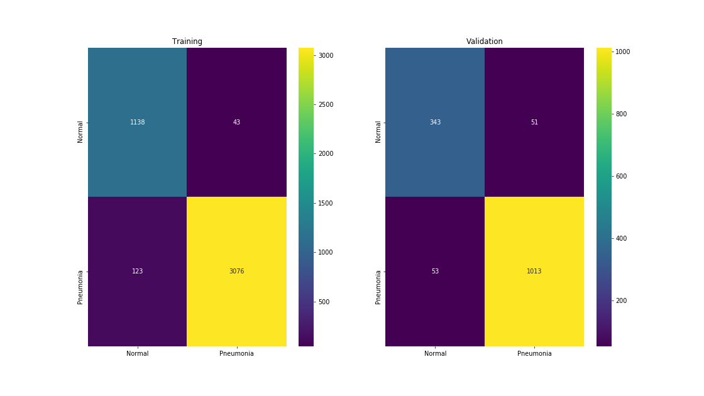
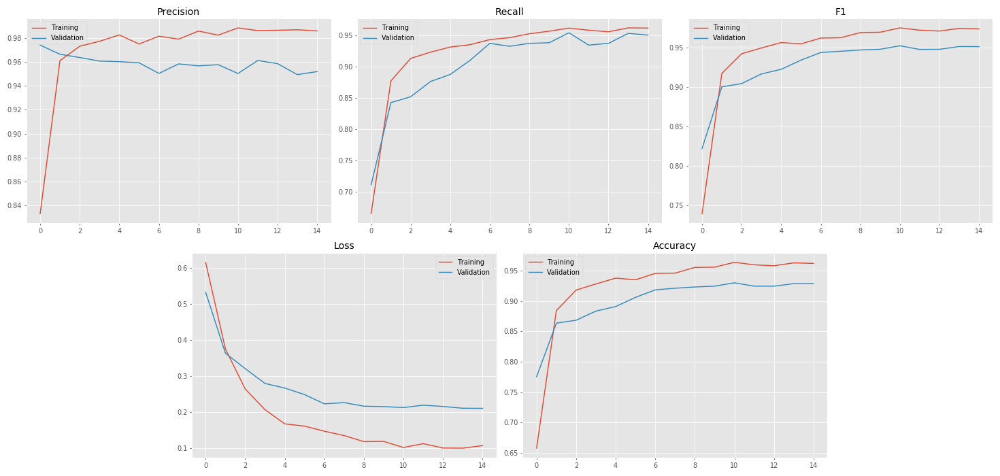

# Chest X-Ray classification with PyTorch
This is my take on [Chest X-Ray Images (Pneumonia)](https://www.kaggle.com/paultimothymooney/chest-xray-pneumonia) using PyTorch transfer learning.
Checkpoints are available here on my [Google Drive](https://drive.google.com/drive/folders/1rZ8FixPrRzBQi9OX_gAJWXVfXPKyqjLV?usp=sharing)

### Folder structure 
chest_xray/
- test
    - NORMAL
    - PNEUMONIA
- train
    - NORMAL
    - PNEUMONIA
- val
    - NORMAL
    - PNEUMONIA

### Model
I'm using a pretrained version of ResNet18 from [torchvision.models](https://pytorch.org/docs/stable/torchvision/models.html). It is fine-tuned on a NVIDIA GTX 1050 Ti GPU.
### Evaluation  
The model seems to be handling the data pretty well, as shown in confusion matrices and logged metrics. In total, 104 images have been incorrectly classified. There is a much higher possibility of a healthy patient to be classified as as sick than the other way around, which means that fewer infected patients will go without treatment.

 However, there are serious signs of overfitting.

  This might indicate that the model needs more hyperparameter tuning or ResNet18 is far from being an optimal choice for this specific task and perhaps another model might do the trick just right. Another issue is lack of data, since we are only given around 6000 images to train and validate the model on.

---
### Contributors  
- Krzysztof Kwaśniak 
    - 
